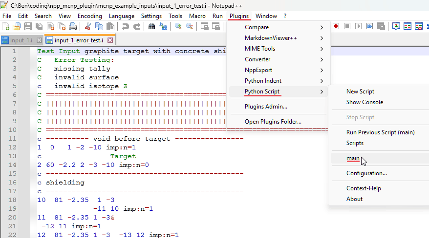
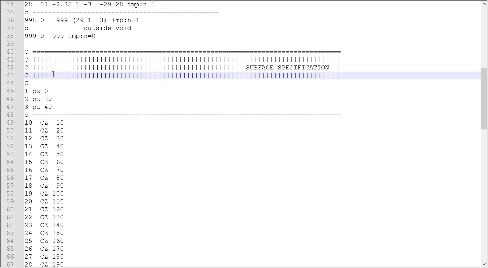
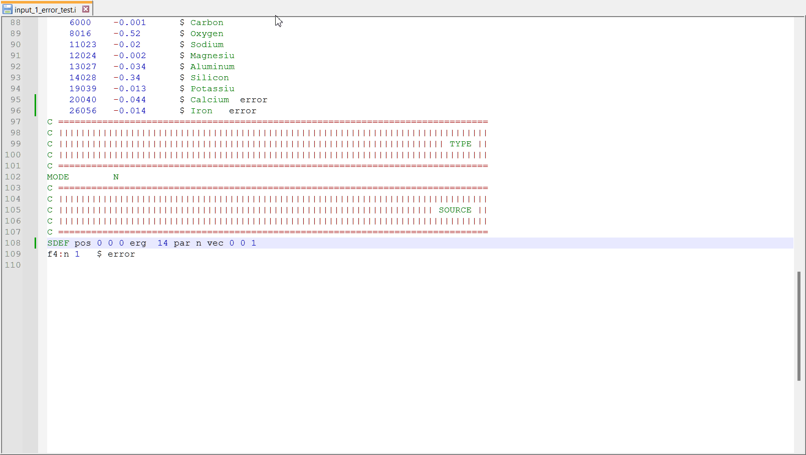

NPP_MCNP_Plugin
==============
<!-- TOC -->

- [NPP_MCNP_Plugin](#npp_mcnp_plugin)
    - [Introduction](#introduction)
    - [Installation](#installation)
    - [Usage](#usage)
    - [Features](#features)
        - [General](#general)
        - [Generative Methods](#generative-methods)
        - [Autocomplete](#autocomplete)
        - [Cells Block Information](#cells-block-information)
        - [Surfaces Block Information](#surfaces-block-information)
        - [Physics Block Information](#physics-block-information)
        - [MCNP Error Checking](#mcnp-error-checking)
    - [Examples](#examples)
    - [Attributed Files](#attributed-files)

<!-- /TOC -->
## Introduction

NPP_MCNP_Plugin is an extension for Notepad++ designed to enhance the productivity of users working with MCNP (Monte Carlo N-Particle) files. It offers model analytics, including surface, cell, and material tracking, directly within the Notepad++ environment.

## Installation

1. Download the latest release of Python Script using the Notepad++ Plugins Admin.
2. Navigate to the Notepad++ installation path
3. place the npp_mcnp_plugin directory in the ../plugins/PythonScript/lib folder
4. place the main.py file in the ../plugins/PythonScript/scripts

## Usage

After installation, the plugin can be accessed via the `plugins -> PythonScript -> scripts -> main` in Notepad++. The plugin needs to be launched for each instance of Notepad++. 

One can set up the shortcuts to the script following the advise in the discussion: <https://community.notepad-plus-plus.org/topic/14703/run-python-script-pythonscript-plugin-with-a-shortcut/3>

## Features

### General

- Ignores file extensions associated with other programs (.py, .cpp, .txt etc)
- file reload on tab switch in notepad++ (based on filename change)
- Maps project dependencies: Identifies and Analyzes the main MCNP input file to identify and list dependent files. (palnned)

### Generative Methods

- **Status**: Planned
- **Description**: impement generative methods to simplify MCNP input writting.
  - implement command to auto generate basic input structure, for example \generate input creates all basic blocks of MCNP input
  - implement LLM based input generation for example \generate input with beam neutron source and a collimator for detector simulations
  
### Autocomplete

- **Status**: Planned
- **Description**: Autocomplete feature that suggests MCNP keywords and parameters as you type. This aims to boost productivity by offering real-time suggestions and minimizing syntax errors. The feature will be context-aware, providing suggestions based on the specific block you are working in:
  - **In Cell Block**:
    - Suggest autocomplete surface ID during typing from the available surface dictionary. (completed)
    - suggest autocoplete the cell name after "#\d+". (completed)
    - Suggest a new cell ID after a newline in the cell block.
    - Suggest a material ID after one digit is typed;(completed)
    - Suggest available transformations after typing "trcl=\d+".  (completed)
    - add popup for the selections to provide basic information about the card
  - **In Surface Block**:
    - Suggest a new surface ID after a newline.
    - Auto-popup to show available transformations when typed "\tr".
  - **In Physics Block**:
    - When in tallies, suggest available surfaces or cells depending on the tally. This will require context awareness about what type of tally it is.

### Cells Block Information

- **Status**: Completed
- **Description**: For cell blocks,
- selecting a specific cell displays a list of other cells where that cell is used, facilitating a deeper understanding of cell interactions within the model.
- Selecting the material popups info about the material.
- selecting surfaces popups information about the selected surfaces.

### Surfaces Block Information

- **Status**: Completed
- **Description**:
  - selecting a surface type provides information about that type. May add more surface types in data/surface_info.json
  - selecting the transformation of the surface popups info about that trcl

### Physics Block Information

- **Status**: Planned
- **Description**: Plans to develop functionalities for physics blocks are in place. This will allow users to access pertinent information and insights specific to physics blocks.
  - pop information about surfaces in ssr/ssw card
  - info about cells in ssr/ssw card
  - info about cells in sdef
  - info about surfaces in sdef

### MCNP Error Checking

- **Status**: Completed
- **Description**: Pops a message after parsing the MCNP input and checking if
  - tally particle identifiers are valid
  - +f6 tally doesnt have a particle identifier
  - tally parameters (cells or surfaces) are missing
  - tally is missing
  - surface type is invalid
  - transformation parameters are missing
  - cell entries(surface or #cell) are not integers
  - cell surface entries exist

## Examples

Notification on cell block and surface block information happens once you select the card of interest.

The error checking happens every time you save a file and pops a separate window with comprehensive information.

## Attributed Files

This repository includes a JSON data file (data/mcnp.tmSnippets.json) originally created by repositony <https://github.com/repositony/vscode_mcnp.git> . It is licensed under the GNU General Public License v3.0. You can find the full text of the license in the LICENSE file.
